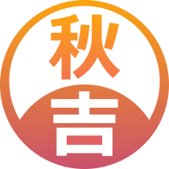

  
  

    RAFAEL AKIYOSHI
     
    Software Engineer 
  

  

---

Hello! 👋

I'm Rafael Akiyoshi, but people usually call me Akiyoshi. I'm a Software Engineer graduated in Brazil, but currently living/working in Montreal-Canada. I love coding anything, but mostly JavaScript! I'm always willing to learn new things about this endless world of software development, so if you have a great resource, please share it with me! 😄

Want to know more about me? [Check out my portfolio.](https://new-portfolio-ruby-five.vercel.app/)
 
 

## 💼 Skills

 
 

 
 

 
 

<!--
**rafaelakiyoshi/rafaelakiyoshi** is a ✨ _special_ ✨ repository because its `README.md` (this file) appears on your GitHub profile.

Here are some ideas to get you started:

- 🔭 I’m currently working on ...
- 🌱 I’m currently learning ...
- 👯 I’m looking to collaborate on ...
- 🤔 I’m looking for help with ...
- 💬 Ask me about ...
- 📫 How to reach me: ...
- 😄 Pronouns: ...
- ⚡ Fun fact: ...
-->
